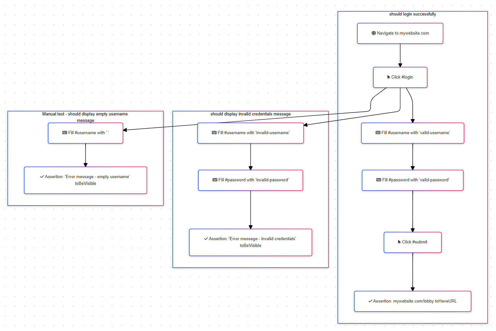

## Getting started

Execute the following to generate a mermaid formatted file, from your test file.

```
node generateMermaid.js
```

The test file location is defined in the generateMermaid.js

```
// Path to the Playwright test file
const testFile = 'example.test.js';  // Update with your test file name if needed
```

### Example input

```
const { test, expect } = require('@playwright/test');

test('should login successfully', async ({ page }) => {
  await page.goto('https://mywebsite.com');
  await page.click('#login');
  await page.fill('#username', 'valid-username');
  await page.fill('#password', 'valid-password');
  await page.click('#submit');
  await expect(page).toHaveURL('https://mywebsite.com/lobby');
});

test('should display invalid credentials message', async ({ page }) => {
    await page.goto('https://mywebsite.com');
    await page.click('#login');
    await page.fill('#username', 'invalid-username');
    await page.fill('#password', 'invalid-password');
    await expect(page.getByText('Error message - invalid credentials')).toBeVisible();
});

test('should display empty username message', { tag: '@manual' }, async ({ page }) => {
    await page.goto('https://mywebsite.com');
    await page.click('#login');
    await page.fill('#username', ' ');
    await expect(page.getByText('Error message - empty username')).toBeVisible();
});
```

### Example output


